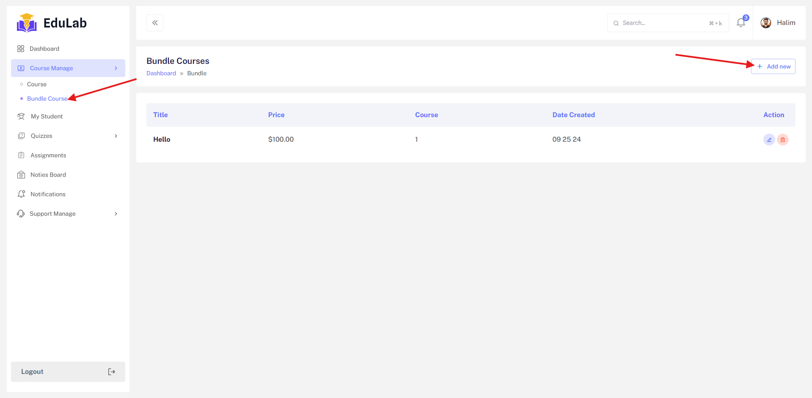

## Create Course

Login as Instructor->Course Manage->Course Bundle

Click on `add button` then you will see form. Fill up the information the submit then you will see the bundle list and also Edit specific bundle.

